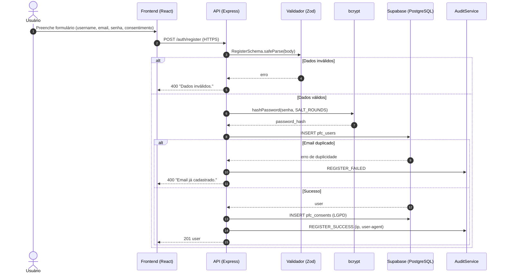
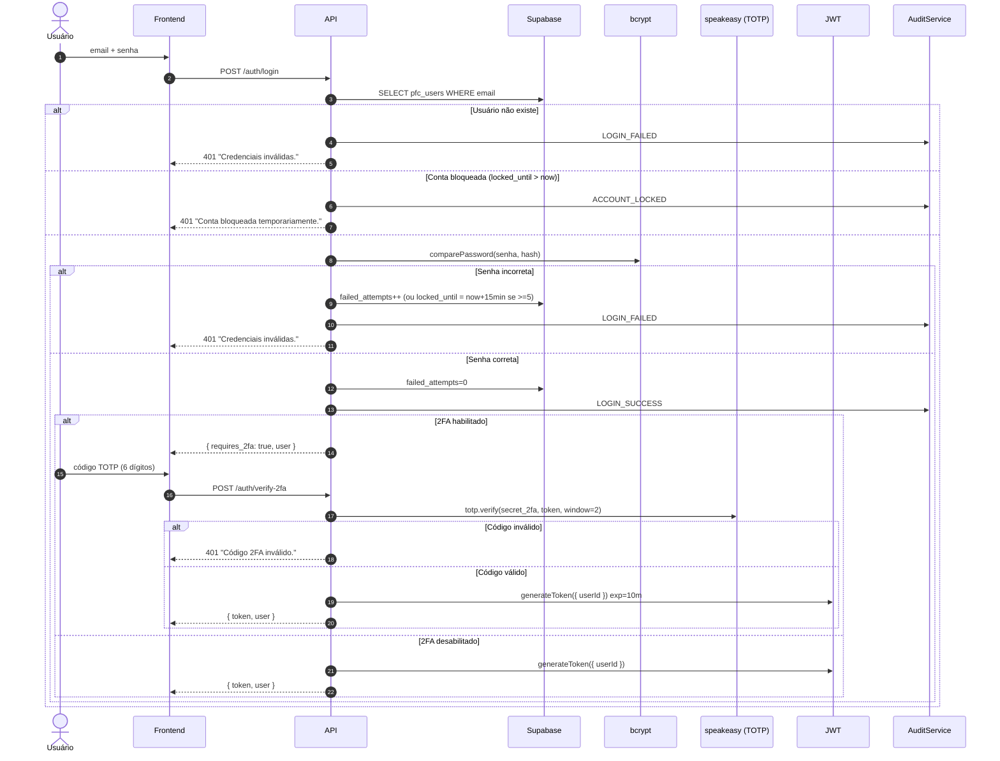
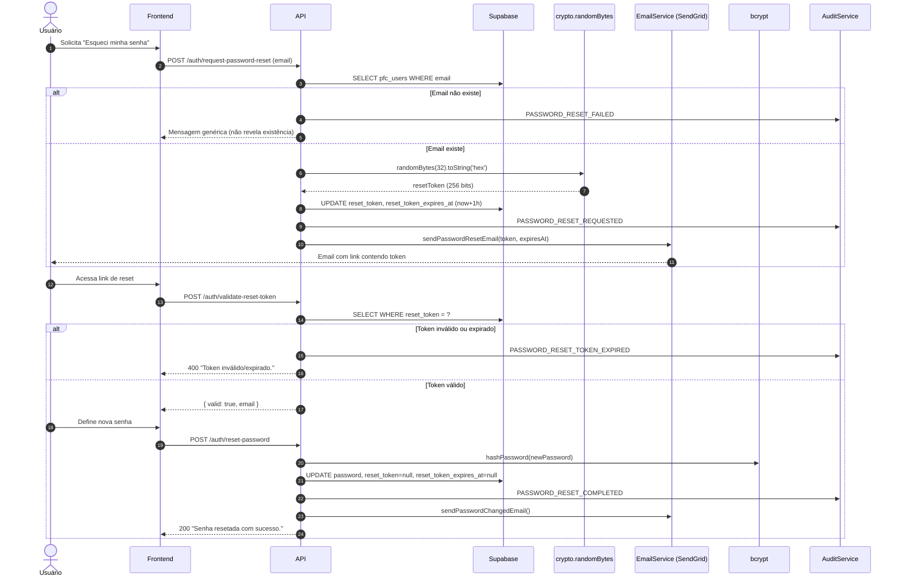

# Fluxo de Autenticação

Este documento descreve os fluxos de autenticação implementados no sistema PFC: **Cadastro**, **Login com 2FA** e **Redefinição de Senha**.

---

## 1. Cadastro de Usuário

Endpoint: `POST /auth/register`



**Pontos de segurança aplicados:**
- Validação de entrada com **Zod** (`RegisterSchema`).
- Senha armazenada como hash **bcrypt** (`BCRYPT_SALT_ROUNDS` configurável).
- Normalização do email para minúsculas (evita contas duplicadas).
- Registro de **consentimento LGPD** atômico (rollback do usuário caso falhe).
- Auditoria de tentativas (sucesso e falha) com IP e User-Agent.

---

## 2. Login com Autenticação em Dois Fatores (2FA)

Endpoints: `POST /auth/login` e `POST /auth/verify-2fa`



**Pontos de segurança aplicados:**
- Bloqueio de conta após **5 tentativas falhas** por **15 minutos** (`MAX_ATTEMPTS=5`, `LOCK_TIME=15min`).
- Mensagens de erro genéricas (não revelam se o e-mail existe).
- TOTP com `speakeasy` (RFC 6238), janela de tolerância de 2 períodos.
- JWT de curta duração (**10 minutos**), assinado com `JWT_SECRET`.
- Rate limit global: 100 req / 15 min por IP (`express-rate-limit`).

---

## 3. Redefinição de Senha

Endpoints: `POST /auth/request-password-reset`, `POST /auth/validate-reset-token`, `POST /auth/reset-password`



**Pontos de segurança aplicados:**
- Token de reset gerado com `crypto.randomBytes(32)` (**256 bits de entropia**).
- Validade do token: **1 hora** (`RESET_TOKEN_EXPIRY`).
- Token invalidado após uso (campos `reset_token` e `reset_token_expires_at` zerados).
- Mensagem genérica quando o email não existe (evita user enumeration).
- Notificação por e-mail ao concluir a troca (detecção de uso indevido).

---

## 4. Acesso a Rotas Protegidas

```mermaid
sequenceDiagram
    autonumber
    actor U as Usuário autenticado
    participant F as Frontend
    participant MW as authMiddleware
    participant JWT as JWT
    participant CTRL as Controller

    U->>F: Ação que exige autenticação
    F->>MW: Request com header "Authorization: Bearer <token>"
    alt Sem header
        MW-->>F: 401 "Token não fornecido."
    else
        MW->>JWT: verifyToken(token)
        alt Token inválido/expirado
            JWT-->>MW: erro
            MW-->>F: 401 "Token inválido ou expirado."
        else Token válido
            JWT-->>MW: { userId }
            MW->>CTRL: req.user = { userId }; next()
            CTRL-->>F: 200 (recurso)
        end
    end
```
