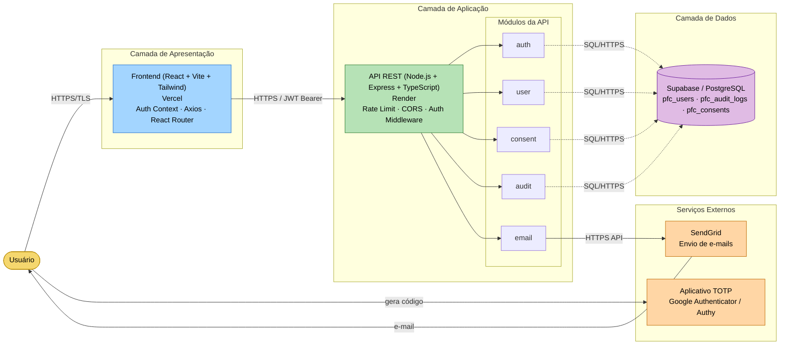
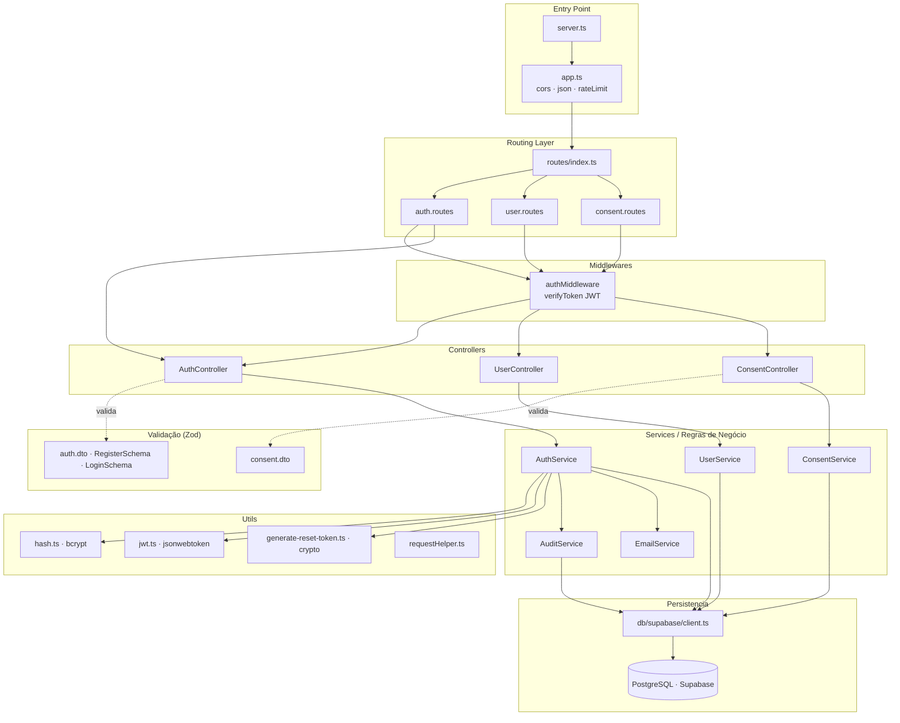
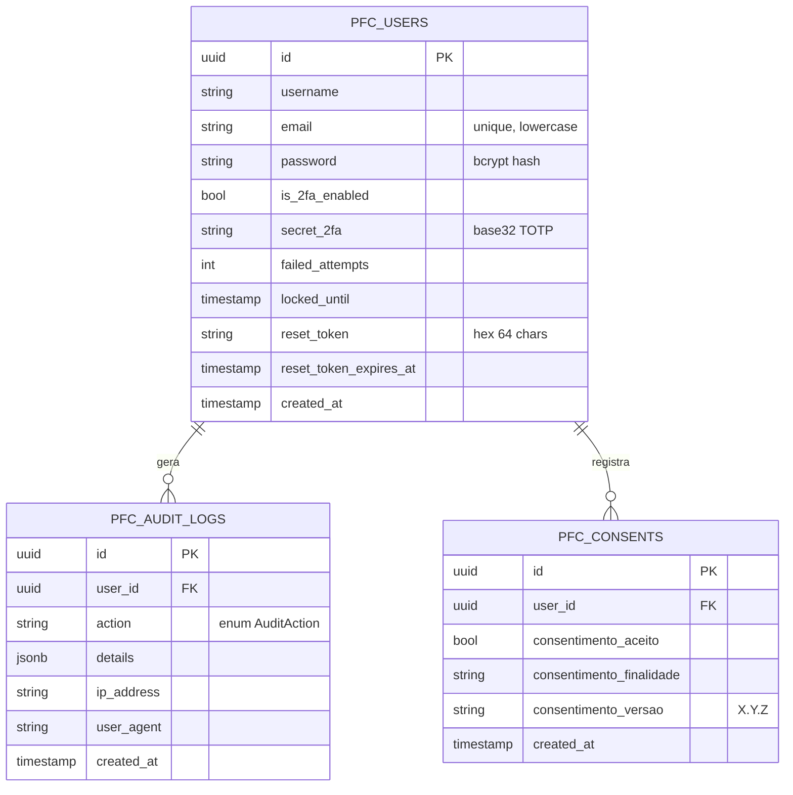
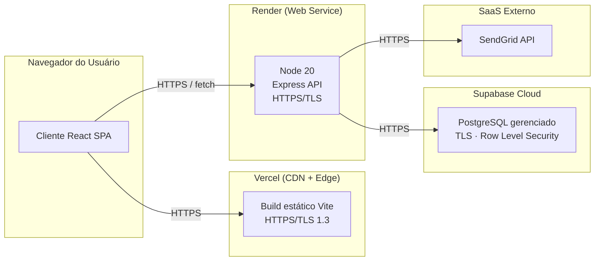

# Arquitetura do Sistema

Este documento apresenta a visão arquitetural do sistema PFC, composto por uma **SPA React** (frontend), uma **API Node.js/Express** (backend) e o **Supabase (PostgreSQL)** como camada de persistência, além de serviços externos para envio de e-mails.

---

## 1. Visão Geral (C4 - Contexto / Containers)

---

## 2. Arquitetura em Camadas (Backend)

A API segue uma estrutura modular orientada a domínio (`modules/<feature>`), com separação clara entre **Rota → Controller → Service → Repositório (Supabase Client)**.

---

## 3. Modelo de Dados (principais tabelas)

---

## 4. Implantação (Deployment)

**Variáveis de ambiente principais** (`api/.env`):
`PORT`, `SUPABASE_URL`, `SUPABASE_ANON_KEY`, `JWT_SECRET`, `BCRYPT_SALT_ROUNDS`, `EMAIL_FROM`, `SENDGRID_API_KEY`, `FRONTEND_URL`.

---

## 5. Padrões e Decisões Arquiteturais

| Decisão | Justificativa |
|---|---|
| **Modular por feature** (`modules/auth`, `modules/user`, …) | Alta coesão, baixo acoplamento, fácil evolução. |
| **Validação com Zod nas DTOs** | Garante contratos de entrada antes de tocar a camada de serviço. |
| **JWT stateless (10 min)** | Reduz superfície de ataque; força renovação frequente. |
| **bcrypt** para senhas | Algoritmo adaptativo padrão da indústria; resistente a brute-force. |
| **TOTP (RFC 6238) via speakeasy** | 2FA off-line, compatível com Google Authenticator / Authy. |
| **Auditoria centralizada** (`AuditService`) | Rastreabilidade exigida pela LGPD e detecção de incidentes. |
| **Rate Limit global** | Mitiga brute-force, scraping e DoS de aplicação. |
| **CORS restrito ao `FRONTEND_URL`** | Bloqueia origens não autorizadas. |
| **Supabase (PostgreSQL gerenciado)** | Backups, criptografia em repouso e em trânsito out-of-the-box. |
