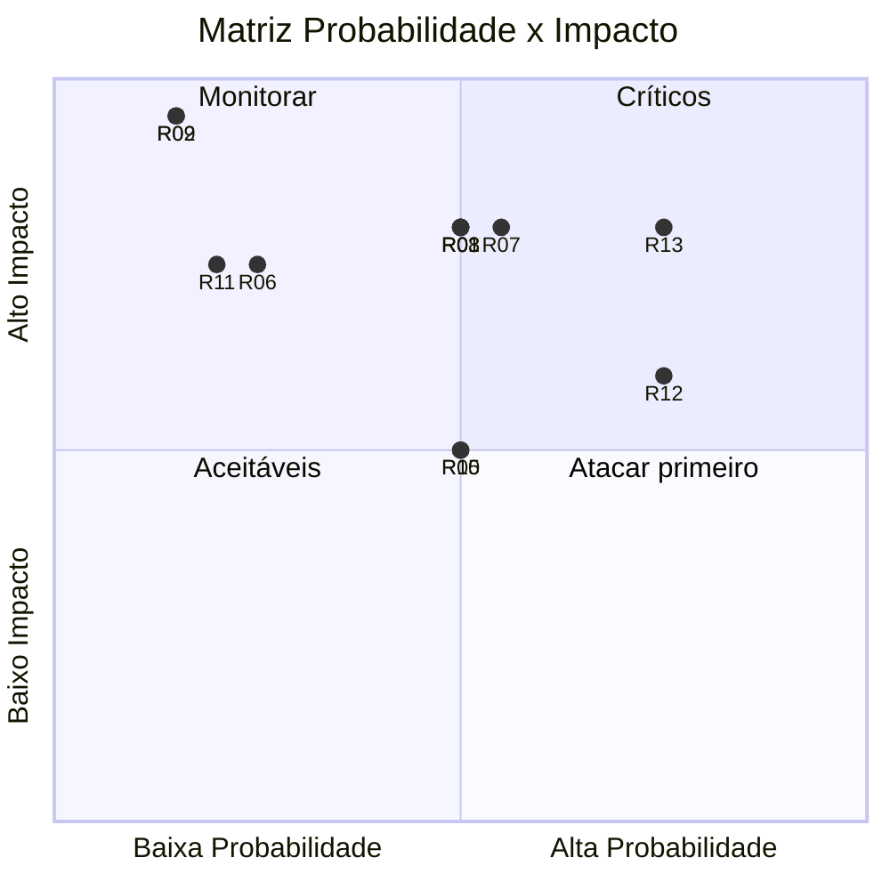
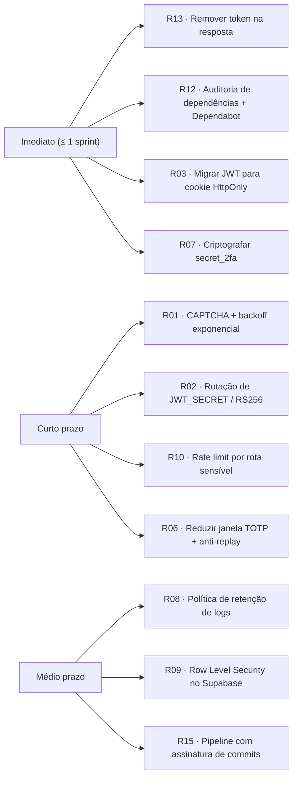

# Análise de Riscos de Segurança

Análise dos principais riscos do sistema PFC, baseada no **OWASP Top 10 (2021)** e nas características específicas do projeto (autenticação, 2FA e reset de senha). Cada risco é classificado por **Probabilidade × Impacto** e acompanhado de controles existentes e recomendações.

---

## 1. Matriz de Risco

| ID | Risco | Categoria OWASP | Probabilidade | Impacto | Nível |
|----|-------|-----------------|---------------|---------|-------|
| R01 | Roubo / vazamento de credenciais (brute force, credential stuffing) | A07 – Identification & Auth Failures | Média | Alto | **Alto** |
| R02 | Comprometimento do `JWT_SECRET` | A02 – Cryptographic Failures | Baixa | Crítico | **Alto** |
| R03 | Sequestro de token JWT (XSS / armazenamento inseguro) | A03 – Injection / A07 | Média | Alto | **Alto** |
| R04 | Reuso ou interceptação do token de reset de senha | A07 | Baixa | Alto | **Médio** |
| R05 | User enumeration via mensagens de erro / endpoints | A01 – Broken Access Control | Média | Médio | **Médio** |
| R06 | Bypass do 2FA (replay de OTP, janela ampla) | A07 | Baixa | Alto | **Médio** |
| R07 | Exposição do segredo 2FA armazenado em claro no banco | A02 | Média | Alto | **Alto** |
| R08 | Vazamento de dados pessoais (LGPD) por logs ou auditoria mal protegida | A09 – Logging & Monitoring Failures | Média | Alto | **Alto** |
| R09 | Injeção SQL / NoSQL nos filtros do Supabase | A03 | Baixa | Crítico | **Médio** |
| R10 | Negação de serviço (DoS) por flood de requisições | A05 – Security Misconfiguration | Média | Médio | **Médio** |
| R11 | CORS mal configurado permitindo origens não autorizadas | A05 | Baixa | Alto | **Médio** |
| R12 | Dependências vulneráveis (npm) | A06 – Vulnerable Components | Alta | Médio | **Alto** |
| R13 | Erro de configuração de variáveis de ambiente em produção (e.g., `resetToken` retornado no response) | A05 | Alta | Alto | **Alto** |
| R14 | SSRF / abuso do provedor de e-mail | A10 – SSRF | Baixa | Médio | **Baixo** |
| R15 | Falha de integridade no pipeline de deploy | A08 – Software & Data Integrity | Baixa | Alto | **Médio** |

---

## 2. Análise Detalhada e Controles

### R01 – Brute Force / Credential Stuffing
- **Controle existente:** `failed_attempts` + bloqueio de 15 min após 5 falhas; `express-rate-limit` (100 req/15min); mensagens genéricas.
- **Recomendação:** adicionar **CAPTCHA** após 3 falhas; bloqueio progressivo (exponencial); detecção por IP + email; integração com bases de senhas vazadas (HIBP).

### R02 – Comprometimento do JWT_SECRET
- **Controle existente:** segredo em variável de ambiente, não versionado.
- **Recomendação:** usar **segredo de ≥ 256 bits** aleatório; rotação periódica; mover para *secret manager* (Render Secret Files, AWS Secrets Manager); considerar **JWT assimétrico (RS256)**.

### R03 – Sequestro de Token JWT
- **Controle existente:** JWT com expiração de **10 min**; CORS restrito; HTTPS.
- **Recomendação:** armazenar token em **cookie HttpOnly + Secure + SameSite=Strict** em vez de `localStorage`; implementar **refresh token** rotativo; CSP estrito no frontend.

### R04 – Token de Reset
- **Controle existente:** 32 bytes (256 bits) via `crypto.randomBytes`; validade 1h; uso único.
- **Risco residual:** o endpoint `request-password-reset` retorna o `resetToken` no JSON (comentário “apenas dev”) – ver R13.
- **Recomendação:** **remover o retorno do token na resposta** antes do go-live; armazenar **hash** do token no banco (não o token em claro).

### R05 – User Enumeration
- **Controle existente:** mensagens genéricas em login e reset.
- **Recomendação:** padronizar tempo de resposta (constant-time) e códigos HTTP em todos os fluxos sensíveis (registro também).

### R06 – Bypass do 2FA
- **Controle existente:** `speakeasy.totp.verify` com janela = 2.
- **Recomendação:** reduzir janela para 1; bloquear reuso do mesmo código (cache do último OTP); aplicar rate limit específico em `/verify-2fa`; auditar `MFA_FAILED`.

### R07 – Segredo 2FA em claro
- **Controle existente:** armazenado em `pfc_users.secret_2fa` (base32).
- **Recomendação:** **criptografar o segredo em repouso** (AES-256-GCM com chave em KMS) ou usar coluna criptografada do PostgreSQL (`pgcrypto`).

### R08 – LGPD / Logs
- **Controle existente:** `AuditService` registra ação, IP, user-agent, detalhes JSON.
- **Recomendação:** evitar gravar dados sensíveis (senha, token) em `details`; criar política de **retenção** dos logs; restringir acesso à tabela `pfc_audit_logs`.

### R09 – Injeção
- **Controle existente:** uso do client Supabase (queries parametrizadas), validação Zod nas entradas.
- **Recomendação:** habilitar **Row Level Security** no Supabase e checagem de ownership (`user_id = auth.uid()`).

### R10 – DoS
- **Controle existente:** rate limit global.
- **Recomendação:** rate limits específicos por rota (`/login`, `/request-password-reset`, `/verify-2fa`); WAF/CDN (Cloudflare) à frente do Render.

### R11 – CORS
- **Controle existente:** `origin: env.frontendUrl`.
- **Recomendação:** validar valor em runtime; manter lista branca e bloquear `*`.

### R12 – Dependências
- **Recomendação:** integrar **`npm audit`**, **Dependabot/Renovate** e **Snyk** ao CI; pinar versões; revisar transitivas.

### R13 – Configurações Inseguras em Produção
- **Encontrado em** [auth.service.ts](api/src/modules/auth/auth.service.ts#L286-L292): o `resetToken` é retornado no corpo da resposta com comentário “Apenas para desenvolvimento - remover em produção!”.
- **Risco:** qualquer ator com acesso à rede ou logs vê o token e pode redefinir a senha.
- **Recomendação:** remover imediatamente; centralizar flags em `env.NODE_ENV` e condicionar respostas debug a ambiente de dev.

### R14 – SSRF
- **Risco:** baixo, pois só há chamada de saída para SendGrid com URL fixa.
- **Recomendação:** manter validação rígida dos endpoints externos; nunca aceitar URL de e-mail vinda do usuário.

### R15 – Integridade de Deploy
- **Recomendação:** habilitar **branch protection**, revisão obrigatória de PR, assinatura de commits, e build reprodutível (lockfile).

---

## 3. Plano de Tratamento (Prioridade)

