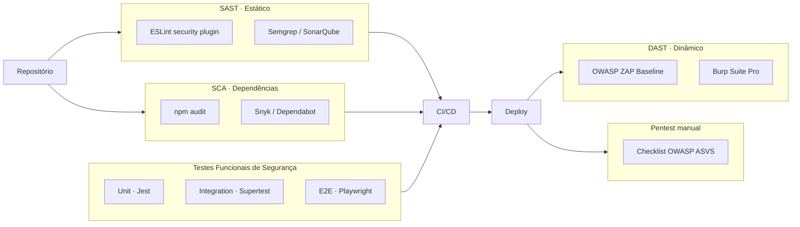

# Testes de Segurança

Plano e casos de teste de segurança aplicáveis ao sistema PFC. Cobre testes **manuais**, **automatizados** e **ferramentas** recomendadas, mapeados ao OWASP ASVS / Top 10 e aos riscos catalogados em [Análise de Riscos](Docs/03-Analise-de-Riscos.md).

---

## 1. Estratégia de Testes



---

## 2. Casos de Teste

### 2.1 Autenticação (Login)

| # | Caso | Pré-condição | Passos | Resultado esperado |
|---|------|--------------|--------|--------------------|
| T01 | Login com credenciais válidas | Usuário existente | POST `/auth/login` com email/senha corretos | 200 + JWT (ou `requires_2fa`) |
| T02 | Login com senha incorreta | Usuário existente | POST `/auth/login` 1x | 401 "Credenciais inválidas." e `failed_attempts++` |
| T03 | Bloqueio após 5 tentativas | Usuário existente | 5x POST `/auth/login` com senha errada | 6ª tentativa: 401 + `locked_until` setado para +15min |
| T04 | Acesso durante bloqueio | Conta bloqueada | POST `/auth/login` com senha **correta** | 401 "Conta bloqueada temporariamente." |
| T05 | User enumeration | — | Comparar resposta para email inexistente vs senha incorreta | Mensagens **e tempos** indistinguíveis |
| T06 | Rate limit | — | 101 requisições em 15 min do mesmo IP | 429 Too Many Requests |
| T07 | SQL Injection no email | — | `email = "' OR 1=1 --"` | 400 Zod (formato inválido); sem vazamento |
| T08 | Login sem HTTPS | Servidor em produção | Acessar via HTTP | Redirect 301 → HTTPS |

### 2.2 2FA / TOTP

| # | Caso | Resultado esperado |
|---|------|--------------------|
| T09 | 2FA com código válido | 200 + JWT |
| T10 | 2FA com código inválido | 401 "Código 2FA inválido." |
| T11 | Replay do mesmo OTP em < 30s | (Recomendado) 401 anti-replay |
| T12 | OTP de janela ±2 períodos | 200 |
| T13 | Tentativa de pular `/verify-2fa` | Endpoint protegido nega acesso sem JWT final |
| T14 | Brute-force de OTP (100 tentativas/min) | Rate limit / bloqueio temporário |

### 2.3 Cadastro

| # | Caso | Resultado esperado |
|---|------|--------------------|
| T15 | Registro válido | 201, hash bcrypt persistido (nunca o plaintext) |
| T16 | Email duplicado | 400 "Email já cadastrado." |
| T17 | Senha < 6 caracteres | 400 "Dados inválidos." |
| T18 | Username com caracteres especiais | 400 (regex `^[a-zA-Z0-9_]+$`) |
| T19 | Sem consentimento (LGPD) | 400 "Consentimento deve ser aceito" |
| T20 | XSS no username/email | Resposta sanitizada; SPA não executa script |

### 2.4 Reset de Senha

| # | Caso | Resultado esperado |
|---|------|--------------------|
| T21 | Solicitar reset com email existente | 200 genérico, token enviado por e-mail |
| T22 | Solicitar reset com email inexistente | 200 genérico (não revela) |
| T23 | Validar token expirado (> 1h) | 400 "Token inválido/expirado." |
| T24 | Reusar token após reset bem-sucedido | 400 (token foi limpo do banco) |
| T25 | Token previsível | Verificar entropia ≥ 256 bits via `crypto.randomBytes(32)` |
| T26 | Reset com nova senha curta | 400 "Senha deve ter pelo menos 6 caracteres." |
| T27 | Token vazado no response | **Falha de segurança** (ver risco R13) |

### 2.5 Autorização / JWT

| # | Caso | Resultado esperado |
|---|------|--------------------|
| T28 | Rota protegida sem token | 401 "Token não fornecido." |
| T29 | Rota protegida com JWT expirado (>10 min) | 401 "Token inválido ou expirado." |
| T30 | JWT assinado com chave errada | 401 |
| T31 | Algoritmo `none` (alg confusion) | 401 (jsonwebtoken rejeita por padrão) |
| T32 | Tampering do payload (userId trocado) | 401 (assinatura inválida) |
| T33 | CORS de origem não autorizada | Preflight bloqueado |

### 2.6 Auditoria / Logs

| # | Caso | Resultado esperado |
|---|------|--------------------|
| T34 | Cada login bem-sucedido gera `LOGIN_SUCCESS` em `pfc_audit_logs` | Linha com `ip_address`, `user_agent`, `created_at` |
| T35 | Bloqueio gera `ACCOUNT_LOCKED` | Linha de auditoria correspondente |
| T36 | Detalhes não contêm senha em claro | Verificar JSON `details` |

---

## 3. Exemplos de Implementação

### 3.1 Unit – senha **nunca** persistida em claro (Jest)

```ts
import { hashPassword, comparePassword } from '../src/utils/hash';

test('hashPassword gera hash bcrypt válido', async () => {
  const hash = await hashPassword('SenhaForte!123');
  expect(hash).not.toBe('SenhaForte!123');
  expect(hash.startsWith('$2')).toBe(true);
  expect(await comparePassword('SenhaForte!123', hash)).toBe(true);
});
```

### 3.2 Integration – bloqueio após 5 tentativas (Supertest)

```ts
import request from 'supertest';
import app from '../src/app';

test('bloqueia conta após 5 tentativas inválidas', async () => {
  for (let i = 0; i < 5; i++) {
    await request(app).post('/auth/login').send({ email: 'u@test.io', password: 'errada' });
  }
  const res = await request(app).post('/auth/login').send({ email: 'u@test.io', password: 'CorretaXyz!' });
  expect(res.status).toBe(401);
  expect(res.body.error).toMatch(/bloqueada/i);
});
```

### 3.3 JWT tampering

```ts
import jwt from 'jsonwebtoken';
import request from 'supertest';
import app from '../src/app';

test('rejeita JWT assinado com chave errada', async () => {
  const fake = jwt.sign({ userId: 'admin' }, 'segredo-falso', { expiresIn: '1h' });
  const res = await request(app).get('/users/me').set('Authorization', `Bearer ${fake}`);
  expect(res.status).toBe(401);
});
```

### 3.4 DAST – OWASP ZAP em CI

```yaml
# .github/workflows/zap.yml
name: ZAP Baseline Scan
on: [workflow_dispatch]
jobs:
  zap:
    runs-on: ubuntu-latest
    steps:
      - uses: zaproxy/action-baseline@v0.12.0
        with:
          target: https://staging.pfc.app
          cmd_options: '-a -j'
```

### 3.5 SCA

```bash
npm audit --omit=dev --audit-level=high
npx snyk test
```

---

## 4. Critérios de Aceitação

- **0 vulnerabilidades** críticas ou altas em `npm audit` na branch principal.
- **100%** dos casos T01–T36 passando no pipeline.
- ZAP Baseline sem alertas **High**.
- Cobertura mínima de **80%** nas rotas/serviços do módulo `auth`.
- Checklist OWASP **ASVS Nível 2** revisado antes de cada release.

---

## 5. Ferramentas Recomendadas

| Tipo | Ferramenta |
|------|------------|
| SAST | ESLint + `eslint-plugin-security`, Semgrep, SonarQube |
| SCA  | `npm audit`, Snyk, Dependabot, Renovate |
| DAST | OWASP ZAP, Burp Suite, Nuclei |
| Secret scanning | gitleaks, GitHub Advanced Security |
| Fuzzing | `@jazzer.js/jest-runner` |
| E2E   | Playwright (com cenários de login/2FA/reset) |
| Monitoramento | Logs estruturados + alertas em `LOGIN_FAILED` / `ACCOUNT_LOCKED` |
