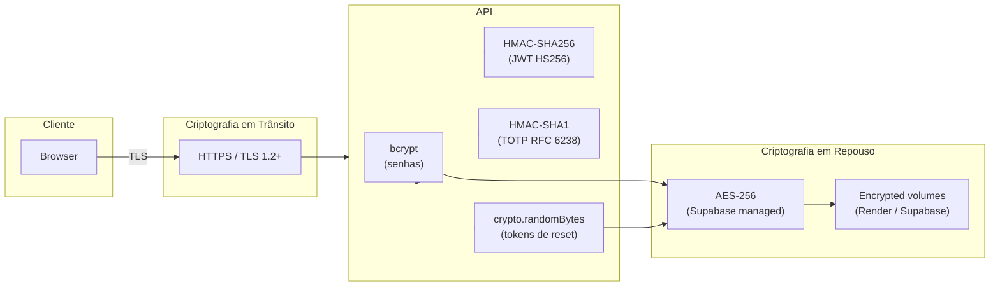
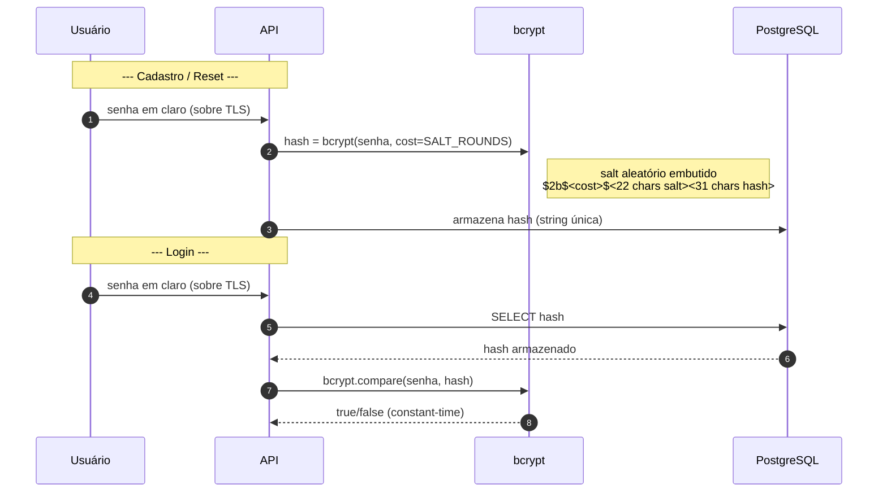
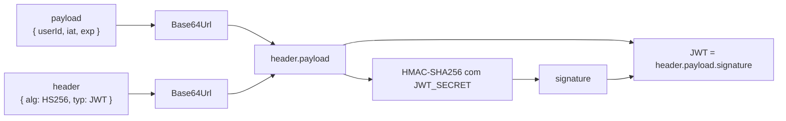
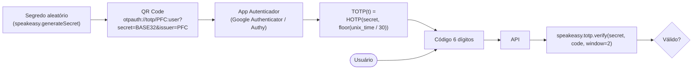
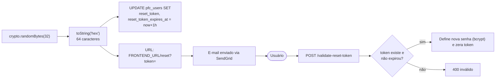
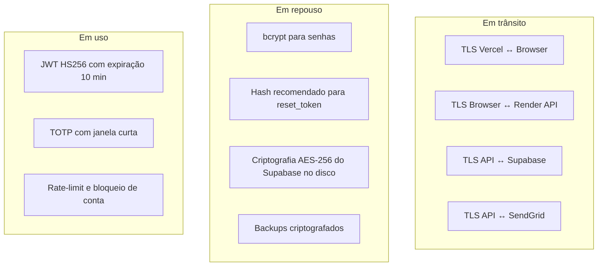

# Criptografia do Sistema

Este documento mapeia todos os usos de criptografia no sistema PFC: **em trânsito**, **em repouso**, **hashing**, **assinatura** e **geração de números aleatórios**. Cada algoritmo é justificado e acompanhado das recomendações de hardening.

---

## 1. Visão Geral

---

## 2. Inventário Criptográfico

| Componente | Onde | Algoritmo | Tamanho / Parâmetros | Biblioteca | Finalidade |
|------------|------|-----------|----------------------|------------|------------|
| TLS Frontend ↔ API | Vercel / Render | TLS 1.2/1.3 (ECDHE + AES-GCM) | 128/256 bits | Plataforma | Confidencialidade e integridade em trânsito |
| Hash de senha | [hash.ts](api/src/utils/hash.ts#L1-L10) | **bcrypt** (Blowfish-based KDF) | `BCRYPT_SALT_ROUNDS` (≥ 10) | `bcrypt` | Armazenamento seguro de senha |
| Assinatura de sessão | [jwt.ts](api/src/utils/jwt.ts#L1-L13) | **HMAC-SHA256 (HS256)** | Segredo simétrico `JWT_SECRET` | `jsonwebtoken` | Autenticidade do JWT (`exp 10 min`) |
| 2FA TOTP | [auth.service.ts](api/src/modules/auth/auth.service.ts#L183-L233) | **HMAC-SHA1 (RFC 6238)** | Segredo 160 bits, janela 30 s | `speakeasy` | Segundo fator de autenticação |
| Token de reset | [generate-reset-token.ts](api/src/utils/generate-reset-token.ts#L1-L5) | **CSPRNG** (`crypto.randomBytes`) | 32 bytes = **256 bits** | Node `crypto` | Reset de senha (uso único, 1 h) |
| Banco de dados | Supabase | **AES-256** em repouso, **TLS** em trânsito | Gerenciado | Supabase | Confidencialidade dos dados persistidos |

---

## 3. Fluxos Criptográficos

### 3.1 Senha de Usuário (registro / login / reset)

**Propriedades:**
- **Sal único por hash** (embutido no formato `$2b$...`).
- **Custo adaptativo** (`cost = 10` → ~100 ms/hash; aumentar com hardware).
- Comparação em **tempo constante** (mitiga timing attacks).

---

### 3.2 JWT (HS256)

Formato: `Base64Url(header).Base64Url(payload).Base64Url( HMAC_SHA256(header.payload, JWT_SECRET) )`

- **Expiração:** 10 minutos (curto).
- **Algoritmo fixo HS256** — jsonwebtoken rejeita `alg: none` por padrão.
- **Recomendação:** migrar para **RS256 / EdDSA** (par de chaves) para evitar que qualquer serviço com `JWT_SECRET` consiga emitir tokens.

---

### 3.3 TOTP – 2FA (RFC 6238)

- HOTP = `Truncate(HMAC-SHA1(secret, counter)) mod 10^6`.
- Período de 30 s, janela de tolerância **±2** (recomendado reduzir para **±1**).
- **Risco residual:** o `secret_2fa` é armazenado em **claro (base32)** no banco. Recomenda-se **criptografá-lo em repouso** (AES-256-GCM com chave em KMS ou `pgcrypto`).

---

### 3.4 Token de Reset de Senha

- **Entropia:** 256 bits → inviável de adivinhar.
- **Uso único** + expiração curta (1 h).
- **Recomendado:** armazenar **`SHA-256(token)`** em vez do token em claro (mitiga vazamento do banco).

---

## 4. Camadas de Proteção

---

## 5. Boas Práticas e Recomendações

1. **Rotação de chaves:** definir cronograma para `JWT_SECRET` e considerar versionamento (`kid` no header).
2. **Migrar JWT para RS256/EdDSA** com par de chaves; chave pública distribuída, privada em KMS.
3. **Criptografar `secret_2fa`** com AES-256-GCM e chave gerenciada (Render Secret Files, AWS KMS, Vault).
4. **Hash do `reset_token`** antes de persistir (`crypto.createHash('sha256').update(token).digest('hex')`).
5. **Aumentar `BCRYPT_SALT_ROUNDS` para 12** em produção (~250 ms/hash).
6. **HSTS + TLS 1.3** obrigatórios; certificados gerenciados pelo provedor.
7. **Política de senhas** mais robusta (mínimo 8, complexidade, verificação contra HIBP).
8. **Cookies HttpOnly + Secure + SameSite=Strict** para armazenar o JWT em vez de `localStorage`.
9. **Logging seguro:** nunca registrar segredos, tokens ou senhas em `pfc_audit_logs`.
10. **Auditoria criptográfica** periódica (Mozilla SSL Test, `testssl.sh`).

---

## 6. Referências

- OWASP **ASVS v4** — V2 Authentication, V6 Cryptography
- NIST **SP 800-63B** — Digital Identity Guidelines
- RFC **6238** — TOTP
- RFC **7519** — JSON Web Token
- OWASP **Password Storage Cheat Sheet**
