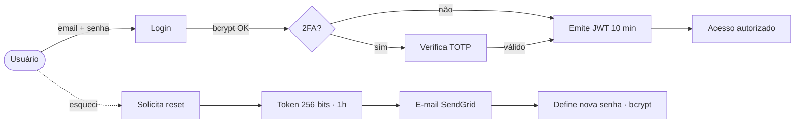
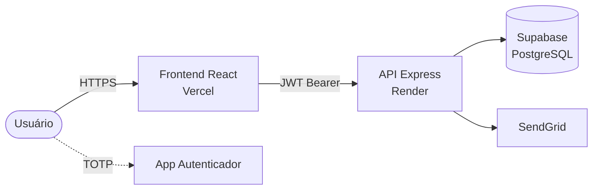
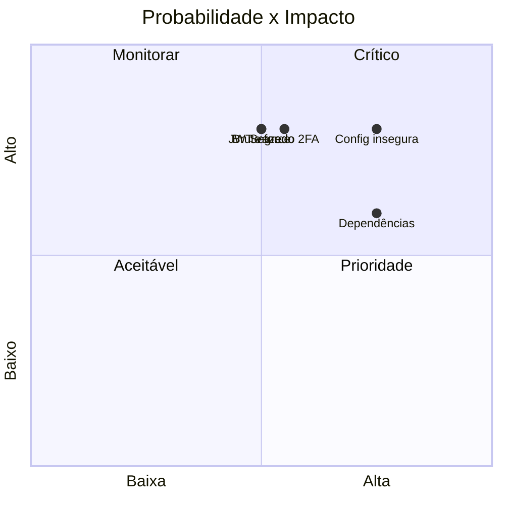
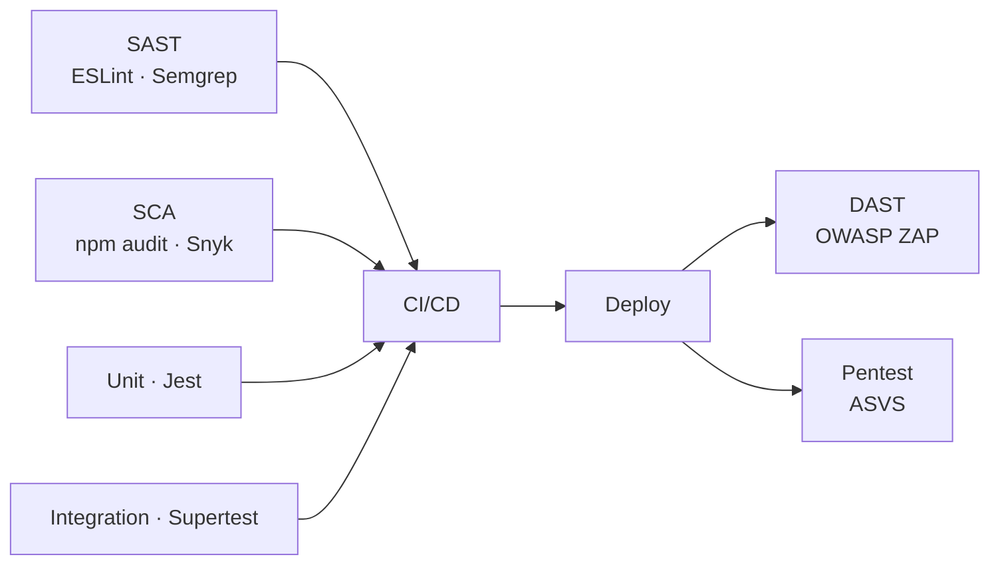
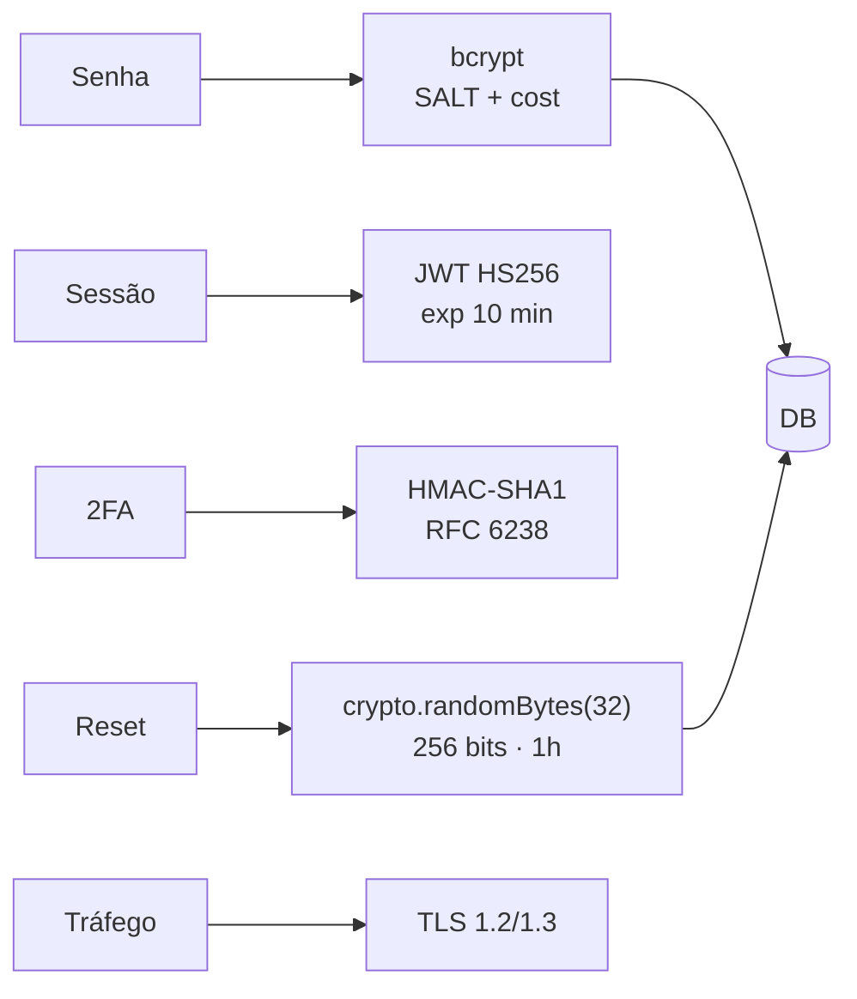
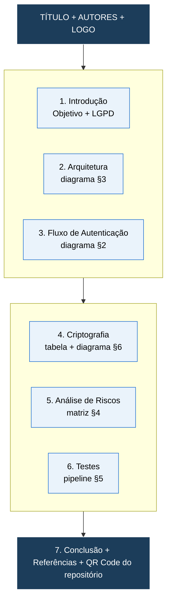

# Resumo Visual para Pôster — Sistema PFC

Documento-síntese com **prévias compactas** dos principais diagramas e textos curtos prontos para um pôster acadêmico. Cada bloco já está dimensionado para caber em uma seção do pôster (A1/A0).

> Diagramas completos: [01-Fluxo](Docs/01-Fluxo-de-Autenticacao.md) · [02-Arquitetura](Docs/02-Arquitetura-do-Sistema.md) · [03-Riscos](Docs/03-Analise-de-Riscos.md) · [04-Testes](Docs/04-Testes-de-Seguranca.md) · [05-Criptografia](Docs/05-Criptografia-do-Sistema.md)

---

## 1. Cabeçalho do Pôster (texto pronto)

> **Sistema PFC – Autenticação Segura com 2FA e LGPD**
> Aplicação web full-stack (React + Node/Express + Supabase) que implementa cadastro com consentimento, login com segundo fator TOTP, redefinição de senha por token criptográfico e auditoria completa de eventos — seguindo recomendações do OWASP Top 10 e da LGPD.

**Palavras-chave:** autenticação · 2FA · bcrypt · JWT · TOTP · LGPD · OWASP

---

## 2. Fluxo de Autenticação (prévia)

**Destaques (3 bullets para o pôster):**
- Senha protegida com **bcrypt** (salt único + custo adaptativo).
- **2FA TOTP** (RFC 6238) compatível com Google Authenticator/Authy.
- Bloqueio automático após **5 tentativas** por **15 minutos**.

---

## 3. Arquitetura do Sistema (prévia)

**Destaques:**
- **Camadas:** Apresentação (React) → Aplicação (Express modular) → Dados (Supabase).
- **Modular por feature:** `auth`, `user`, `consent`, `audit`, `email`.
- **Deploy:** Vercel (front) + Render (API) + Supabase (DB gerenciado).

---

## 4. Análise de Riscos (prévia)

**Top 5 riscos tratados:**
1. **Brute force** → rate limit + bloqueio de conta.
2. **Sequestro de JWT** → expiração curta (10 min) + HTTPS + CORS.
3. **User enumeration** → mensagens genéricas.
4. **LGPD** → consentimento obrigatório + auditoria.
5. **Reset de senha** → token de 256 bits, uso único, expira em 1 h.

---

## 5. Testes de Segurança (prévia)

**Cobertura:**
- **36 casos de teste** mapeados (login, 2FA, cadastro, reset, JWT, auditoria).
- Critério: **0 vulnerabilidades High** no `npm audit` e no **OWASP ZAP**.
- Meta: **≥ 80%** de cobertura no módulo `auth`.

---

## 6. Criptografia (prévia)

**Resumo numérico (ideal para o pôster):**

| Item | Algoritmo | Tamanho |
|------|-----------|---------|
| Senha | bcrypt | salt 128 bits · cost ≥ 10 |
| JWT | HMAC-SHA256 | exp **10 min** |
| 2FA | TOTP / HMAC-SHA1 | segredo 160 bits · janela 30 s |
| Reset | CSPRNG | **256 bits** · validade **1 h** |
| Transporte | TLS | 1.2 / 1.3 |

---

## 7. Sugestão de Layout do Pôster

**Dicas de apresentação:**
- Use as **prévias** deste documento como figuras finais (exporte SVG via [Mermaid Live](https://mermaid.live)).
- Cada seção do pôster = **1 diagrama + 3 bullets** (regra dos 3).
- Reserve um **QR Code** apontando para o repositório / documentação.
- Paleta sugerida: azul-marinho (cabeçalho) + azul claro (blocos) + branco (fundo).

---

## 8. Frases curtas para "selos" do pôster

- "Senhas nunca em claro — **bcrypt** sempre."
- "Sessão de **10 minutos** + bloqueio após 5 tentativas."
- "**2FA TOTP** offline com qualquer autenticador."
- "Reset com **256 bits** de entropia e validade de 1 hora."
- "Auditoria completa: cada evento sensível é registrado."
- "Conformidade com **LGPD** desde o cadastro."
