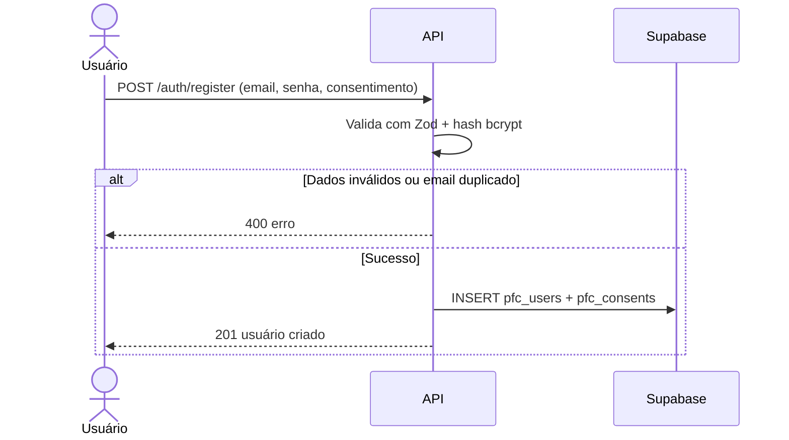
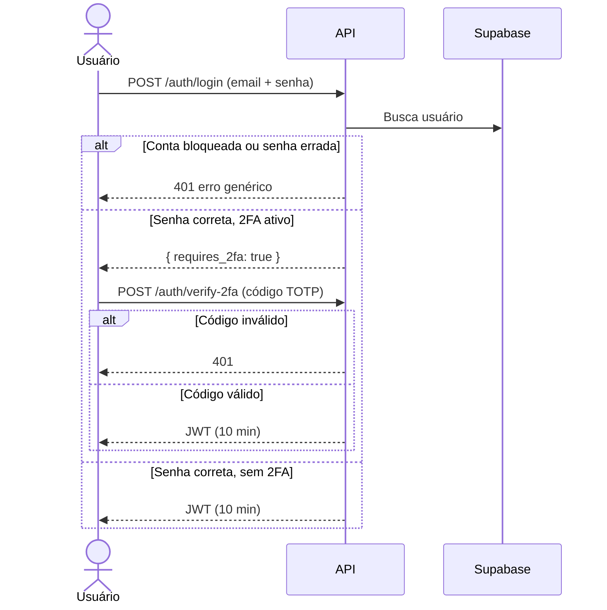

# Fluxo de Autenticação

Este documento descreve os fluxos de autenticação implementados no sistema PFC: **Cadastro**, **Login com 2FA** e **Redefinição de Senha**.

---

## 1. Cadastro de Usuário

Endpoint: `POST /auth/register`

O usuário preenche o formulário com nome de usuário, e-mail, senha e aceite do consentimento LGPD. O frontend envia os dados via HTTPS para a API, que valida a entrada com Zod antes de qualquer operação.

Se os dados forem inválidos, a API retorna `400` imediatamente. Se o e-mail já existir, o registro é rejeitado e o evento `REGISTER_FAILED` é auditado. Em caso de sucesso, a senha é convertida em hash bcrypt, o usuário é inserido junto com o registro de consentimento, e o evento `REGISTER_SUCCESS` é auditado com IP e User-Agent.

**Pontos de segurança aplicados:**
- Validação de entrada com **Zod** (`RegisterSchema`).
- Senha armazenada como hash **bcrypt** (`BCRYPT_SALT_ROUNDS` configurável).
- Normalização do e-mail para minúsculas (evita contas duplicadas).
- Registro de **consentimento LGPD** atômico — rollback do usuário caso falhe.
- Auditoria de tentativas (sucesso e falha) com IP e User-Agent.

---

## 2. Login com Autenticação em Dois Fatores (2FA)

Endpoints: `POST /auth/login` e `POST /auth/verify-2fa`

O usuário informa e-mail e senha. A API busca o usuário no banco e verifica se a conta está bloqueada por tentativas excessivas. Em seguida, a senha é comparada com o hash bcrypt armazenado. Cinco tentativas incorretas consecutivas resultam em bloqueio de 15 minutos.

Se a senha estiver correta e o 2FA estiver habilitado, a API solicita o código TOTP. O código é validado pelo `speakeasy` com janela de tolerância de 2 períodos. Apenas após essa verificação o JWT é emitido com validade de 10 minutos.

**Pontos de segurança aplicados:**
- Bloqueio de conta após **5 tentativas falhas** por **15 minutos**.
- Mensagens de erro genéricas (não revelam se o e-mail existe).
- TOTP com `speakeasy` (RFC 6238), janela de tolerância de 2 períodos.
- JWT de curta duração (**10 minutos**), assinado com `JWT_SECRET`.
- Rate limit global: 100 req / 15 min por IP (`express-rate-limit`).

---

## 3. Redefinição de Senha

Endpoints: `POST /auth/request-password-reset`, `POST /auth/validate-reset-token`, `POST /auth/reset-password`

O usuário solicita a redefinição informando o e-mail. Se o e-mail existir, a API gera um token criptográfico de 256 bits com validade de 1 hora e o envia por e-mail via SendGrid. A resposta é sempre genérica, independentemente de o e-mail existir ou não.

O usuário acessa o link recebido, que valida o token. Se válido, o usuário define uma nova senha, que é armazenada como hash bcrypt. O token é imediatamente invalidado após o uso e um e-mail de confirmação é enviado.

**Pontos de segurança aplicados:**
- Token gerado com `crypto.randomBytes(32)` (**256 bits de entropia**).
- Validade do token: **1 hora**.
- Token invalidado após uso.
- Mensagem genérica quando o e-mail não existe (evita user enumeration).
- Notificação por e-mail ao concluir a troca.

---

## 4. Acesso a Rotas Protegidas

Toda rota protegida passa pelo `authMiddleware`, que extrai o token do header `Authorization: Bearer <token>` e o valida com `jsonwebtoken`. Se o token estiver ausente, expirado ou com assinatura inválida, a requisição é rejeitada com `401` antes de chegar ao controller.

**Fluxo resumido:**

1. Frontend envia requisição com `Authorization: Bearer <token>`.
2. `authMiddleware` chama `verifyToken(token)`.
3. Se válido: `req.user = { userId }` e a requisição segue.
4. Se inválido ou ausente: `401` retornado imediatamente.
