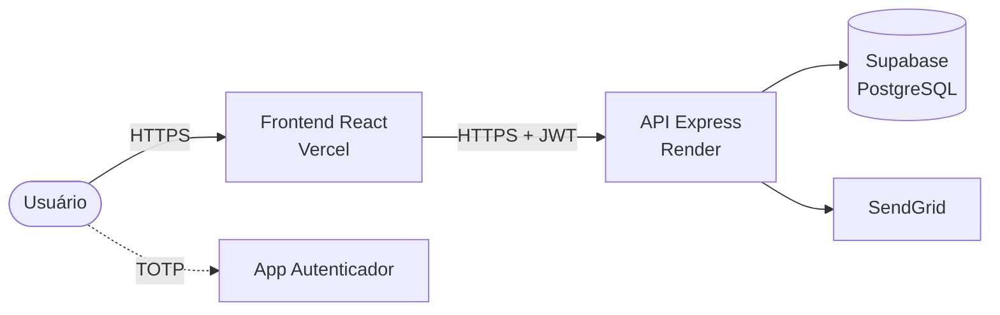

# Arquitetura do Sistema

Este documento apresenta a visão arquitetural do sistema PFC, composto por uma **SPA React** (frontend), uma **API Node.js/Express** (backend) e o **Supabase (PostgreSQL)** como camada de persistência, além de serviços externos para envio de e-mails.

---

## 1. Visão Geral

O sistema é dividido em três camadas principais que se comunicam exclusivamente via HTTPS:

- **Apresentação:** SPA React hospedada na Vercel, responsável pela interface do usuário.
- **Aplicação:** API REST em Node.js/Express hospedada no Render, onde residem todas as regras de negócio, autenticação e segurança.
- **Dados:** Supabase (PostgreSQL gerenciado), com criptografia em repouso e em trânsito.

Serviços externos utilizados: **SendGrid** para envio de e-mails transacionais e qualquer **aplicativo TOTP** (Google Authenticator, Authy) para o segundo fator de autenticação.

---

## 2. Estrutura Modular do Backend

A API segue uma organização modular orientada a domínio (`modules/<feature>`), com separação clara de responsabilidades em quatro camadas:

**Rota → Controller → Service → Repositório (Supabase Client)**

Os módulos existentes são:

| Módulo | Responsabilidade |
|--------|-----------------|
| `auth` | Registro, login, 2FA, reset de senha |
| `user` | Perfil e dados do usuário |
| `consent` | Gestão de consentimentos LGPD |
| `audit` | Registro de eventos com integridade HMAC |
| `email` | Envio de e-mails via SendGrid |

Utilitários compartilhados: `hash.ts` (bcrypt + HMAC), `jwt.ts` (geração/verificação de tokens), `generate-reset-token.ts` (CSPRNG).

---

## 3. Modelo de Dados

As três tabelas principais e seus relacionamentos:

**`pfc_users`** — dados do usuário, hash da senha, controle de tentativas e bloqueio, segredo 2FA e token de reset.

**`pfc_audit_logs`** — eventos auditados (ação, IP, User-Agent, timestamp, `integrity_hash` HMAC-SHA256).

**`pfc_consents`** — registro do consentimento LGPD por usuário (finalidade, versão, data).

Um usuário pode ter múltiplos logs de auditoria e múltiplos registros de consentimento (versionamento).

---

## 4. Implantação

| Componente | Plataforma | Observações |
|------------|-----------|-------------|
| Frontend | Vercel | CDN global, HTTPS/TLS 1.3 automático |
| API | Render | Node 20, HTTPS/TLS, variáveis de ambiente seguras |
| Banco de dados | Supabase Cloud | PostgreSQL gerenciado, AES-256 em repouso, TLS em trânsito |
| E-mail | SendGrid | API transacional, autenticação por chave |

**Variáveis de ambiente principais** (`api/.env`):
`PORT`, `SUPABASE_URL`, `SUPABASE_SERVICE_ROLE_KEY`, `JWT_SECRET`, `BCRYPT_SALT_ROUNDS`, `SENDGRID_API_KEY`, `FRONTEND_URL`.

---

## 5. Decisões Arquiteturais

| Decisão | Justificativa |
|---------|--------------|
| Modular por feature | Alta coesão, baixo acoplamento, fácil evolução independente. |
| Validação com Zod nas DTOs | Garante contratos de entrada antes de tocar a camada de serviço. |
| JWT stateless (10 min) | Reduz superfície de ataque; força renovação frequente. |
| bcrypt para senhas | Algoritmo adaptativo padrão da indústria; resistente a brute-force. |
| TOTP (RFC 6238) via speakeasy | 2FA offline, compatível com Google Authenticator e Authy. |
| AuditService centralizado | Rastreabilidade exigida pela LGPD; integridade via HMAC-SHA256. |
| Rate limit global | Mitiga brute-force, scraping e DoS de aplicação. |
| CORS restrito ao `FRONTEND_URL` | Bloqueia origens não autorizadas em todas as rotas. |
| Supabase gerenciado | Backups, criptografia em repouso e em trânsito sem configuração adicional. |
